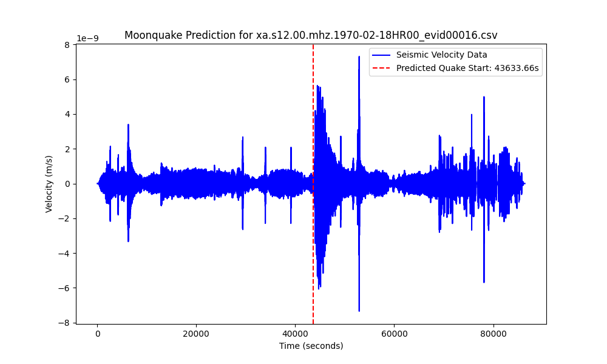

Hi! Yana and Dea here! 

## Project Summary
This project addresses a critical challenge in lunar exploration: detecting and filtering moonquakes from large volumes of seismic data collected by the Apollo missions. **Moonquakes** are important for understanding the moon’s internal structure, but they are rare and buried within long recordings of seismic noise. The key challenge is to accurately detect these moonquakes and distinguish them from background noise.

Given the significant resources required to transmit data from the Moon to Earth, it’s essential to **filter out irrelevant data** and only transmit seismic events of scientific interest. The project uses combination of CNN (Convolutional Neural Network) and LSTM (Long Short-Term Memory) network layers to analyze long, noisy time series data and predict the exact start time of moonquakes. By focusing on temporal patterns in P waves and S waves—key seismic indicators—the model can identify moonquake events. The advantage of the machine learning approach is that the model analyzes both the **shape** and **amplitude** of the signal, rather than just focusing on intensity. This enables the model to effectively filter out high spikes caused by instrumental noise, focusing on meaningful seismic patterns. Here is an example below:

This solution not only supports lunar exploration but also opens the door for broader applications in planetary seismology, helping prioritize the transmission of valuable data from space missions.

## Machine Learning model

Here we put the code that we used to train our model, and to detect quakes on the test data

**Main files**
- **cnn+lstm_v1.ipynb** is the first version of our model. We implemented the architecture using Convolutional Neural Network layers along with the layers of Long Short-Term Memory Network. This combination allowed the neural network to focus both on the local patterns, and on the temporal dependencies in bigger picture.
- **cnn+lstm_feature_engin_v2.ipynb** is the second version. We built up upon the v1, using the feature engineering. We added the second feature, which is the derivative of the velocity. It helped to provide the model with the data on how fast the velocity changes, which in turn will help to focus more on the spikes.

Folder **predictions_plots_v1** and **predictions_plots_v2** contains the visualised predictions for each of the test files. Additionally, the folder with combined figures was created, where you can compare them side by side

## Next steps
There are a lot of possible improvements that could be adde to the existing code to improve the accuracy. For example:
- Preliminary processing of the data to remove the noise
- Engineering of another feature using Fourier transform. It can provide the model with better insights in the data, rather than feeding just the raw velocities.
- Tuning the hyperparameters used for learning
- Tuning the parameters in the model's architecture (e.g layer size)
- Comparing performance of different models, and possibly combining them in two-steps detection
